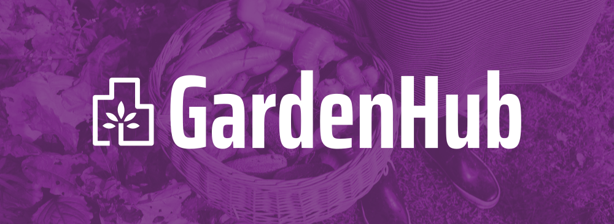

[](https://travis-ci.org/HarvestHub/GardenHub)
[](https://coveralls.io/github/HarvestHub/GardenHub)
[](https://codeclimate.com/github/HarvestHub/GardenHub/maintainability)
[](https://snyk.io/test/github/harvesthub/gardenhub)
[](https://requires.io/github/HarvestHub/GardenHub/requirements/?branch=master)
[](http://gardenhub.readthedocs.io/en/latest/?badge=latest)
[](https://www.gnu.org/licenses/agpl-3.0)

# GardenHub

Formed around the simple idea that food should not go to waste, GardenHub is the solution to the problem of community garden food waste. Despite the best efforts of community gardeners, far too often food produced in community gardens rots on the vine.

GardenHub is building technology to enable gardeners to collaborate and act upon what's growing, ripening, and available for harvest in their gardens. Using this information, GardenHub notifies gardeners, local charities, restaurants, and other stakeholders of the availability of this food.

[Read the full documentation on Read the Docs.](https://gardenhub.readthedocs.io/en/latest/)

## WIP

GardenHub is a work in progress web application being developed in the open. It's licensed under AGPL-3.0+ and written in Python using the Django framework. You can preview our work on the [demo site](http://gardenhub.candlewaster.co/), but keep in mind that it will change dramatically.

Eventually, the inner-workings of this project will be documented in detail. We're making an effort to self-document the code, so take a look. You're welcome to chat with us by opening a GitHub issue. GardenHub is a project by HarvestHub, and it's being developed by Candlewaster.

## Local development

GardenHub provides a script called `dev.sh` to make local development easy. Its only dependency is [Docker](https://docs.docker.com/engine/installation/). As long as you have Docker installed, you do not need Python, Django, Postgres, or anything else running on your computer for local development with `dev.sh`. This is because `dev.sh` automatically configures a local development environment with Docker containers where all of that is already installed.

**Note:** This has been tested on GNU/Linux. Your mileage may vary using Docker on other operating systems.

### Installing Docker

To check if you already have Docker installed, run `docker -v` in your terminal. GardenHub has been tested with version 17. **If you already have it, skip to the next section.**

On most GNU/Linux distros, you can use the following command to install Docker:

```
sudo sh -c "wget -nv -O - https://get.docker.com/ | sh"
```

After Docker is installed, you'll want to add your user to the docker group so you don't need `sudo` to run Docker commands.

```
sudo usermod -aG docker $(whoami)
```

Finally, log out and back into your computer, and then head to the next section.

### Starting the development server

With Docker installed and ready to go, just follow these commands:

```
# Clone the repo
git clone https://github.com/HarvestHub/GardenHub.git

# Enter the project folder
cd GardenHub

# Run the local development server
./dev.sh start
```

It may take a few minutes to download everything the first time, then it will run more quickly on subsequent attempts.

`dev.sh` has a few options you can take advantage of.

| Command   | Description                                                                                                           |
|-----------|-----------------------------------------------------------------------------------------------------------------------|
| start     | Launches a Postgres container and a GardenHub app container then starts `manage.py runserver`.                        |
| build     | Rebuilds the app container. You must do this **manually** if you change requirements.txt.                             |
| manage.py | Same as running `python manage.py` in the app container. Useful for running migrations and other management commands. |
| setup     | Installs Docker. Works on many GNU/Linux distros.                                                                     |

**Hint:** `./dev.sh start` will run migrations every time before it starts the development server. To skip that, you can run `./dev.sh manage.py runserver` to run the development server directly.

### Running migrations and management commands

To run migrations, you can use:

```
# Migrate
./dev.sh manage.py migrate

# Make migrations
./dev.sh manage.py makemigrations
```

Any other management command may also be run this way.

### Rebuilding the container (you have to, sometimes)

Changing application code shouldn't require rebuilding the container. However, you must **manually rebuild the container** any time you edit `requirements.txt`. This is because the requirements get installed into the container at build time. You can rebuild the container like so:

```
./dev.sh build
```

## License

GardenHub is copyright © 2017 HarvestHub and licensed under the GNU AGPL version 3 or later. View the `LICENSE` file for a copy of the full license.
